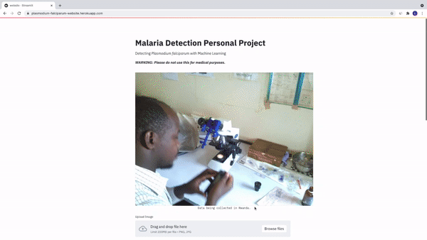

# Malaria-Detector-Streamlit
A Neural Network to Detect Malaria Parasites in Blood Samples

## Background
*Plasmodium falciparum* is a common type of malaria found across Africa. It is also the most deadly form of malaria. You can detect *P. falciparum* by taking blood samples and inspecting them under a microscope. Infected red blood cells may have a darker patch which is the parasite. To train this model, I used a dataset made in Uganda by [J. Quinn et al.](http://air.ug/microscopy/)

## Steps
1. Download the dataset from the link above.
2. Simply use the tensorflow object detection API to train a model
3. Export the inference graph and call it frozen_inference_graph.pb
4. Move the website.py and correct.py files into the object_detection directory
5. On line 76 of correct.py change the MODEL_NAME to the name of your exported model
6. Move both of the images into the object_detection directory

## Demo

